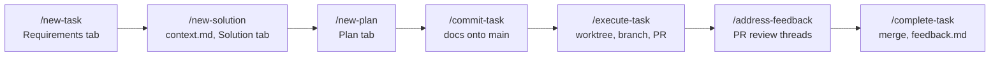
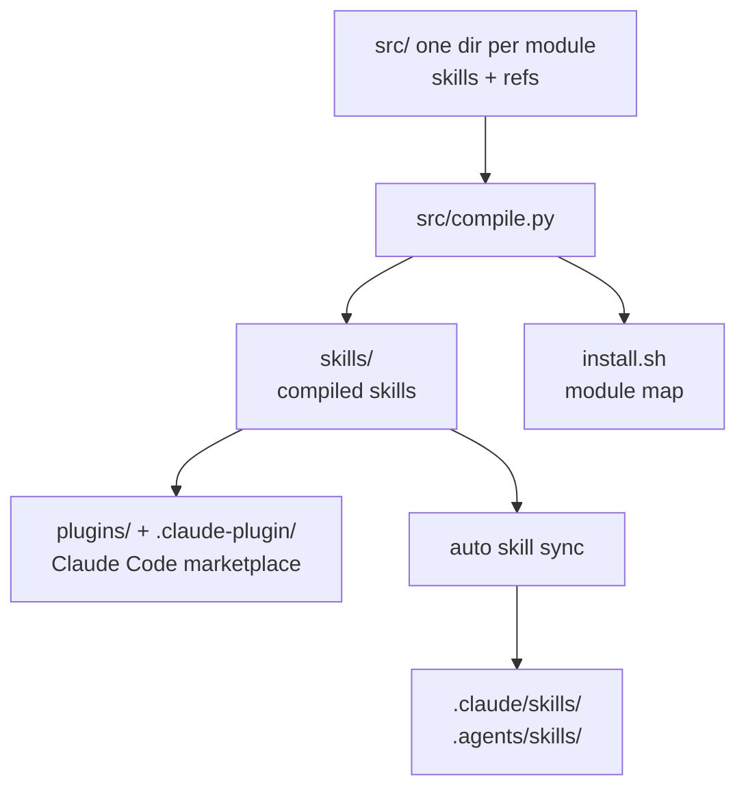

# Skills

A collection of reusable agent skills for planning, executing and shipping software
with AI agents. The core of it is the **Portable Task Workflow** — a plan-to-merge
lifecycle where each stage is a discrete skill — surrounded by skills for ideation,
research, reflection, assurance and documentation.

Skills are portable: `name` + `description` frontmatter plus a markdown body, so they
work in Claude Code, Codex, Gemini CLI and anything else that implements the
[Agent Skills specification](https://agentskills.io/llms.txt).

## Installation

Requires one of the two installers below. The skills themselves have no runtime of
their own; individual skills shell out to `gh`, `herdr`, `claude`, `codex`, `grok`,
`uv` or `python3`, and say so where they do.

### As Claude Code plugins

Each module ships as a Claude Code plugin from a marketplace in this repo. Install
from a Claude Code session:

```
/plugin marketplace add mistakenot/skills
/plugin install planning-workflow@mistakenot-skills
```

or from a shell:

```sh
claude plugin marketplace add mistakenot/skills
claude plugin install planning-workflow@mistakenot-skills
```

Verify:

```sh
claude plugin list
```

Upgrade and uninstall:

```sh
claude plugin marketplace update mistakenot-skills   # refresh the catalogue
claude plugin update planning-workflow               # restart to apply
claude plugin uninstall planning-workflow
claude plugin marketplace remove mistakenot-skills
```

Plugins carry no `version` field, so Claude Code versions each one by git commit SHA
and `update` pulls whatever `main` currently holds.

### With `auto skill`

[`auto`](https://github.com/mistakenot/auto) renders skills into `.claude/skills/`
and `.agents/skills/` at once, so the same install serves several agents. Run it from
the root of the project you want the skills available in.

`auto` resolves output targets from project config rather than per-command flags, so
initialise once per project:

```sh
auto skill init --project --target claude,agents -y
```

Then add everything, or a single skill:

```sh
auto skill add mistakenot/skills --skill '*'
auto skill add mistakenot/skills --skill new-task
```

`--skill` is repeatable and exact-match. Verify, upgrade and uninstall:

```sh
auto skill list                      # authored and vendored skills, with a stale flag
auto skill doctor                    # configuration, ownership drift, project setup
auto skill update                    # float vendored skills to latest upstream
auto skill sync                      # re-render into the target directories
auto skill remove new-task           # drop the skill and prune its rendered copies
```

### With `install.sh`

`install.sh` wraps the same `auto` commands but understands **modules**, so you can
take just the planning skills rather than all of them:

```sh
./install.sh                              # everything
./install.sh --module planning-workflow   # just the planning skills
./install.sh --target claude              # .claude/skills only
```

Run `./install.sh --help` for the module list. In a non-interactive shell it passes
`--trust-requested`, since there is nobody to answer the trust prompt.

## Getting started

The planning workflow takes a feature from a sentence to a merged PR. Planning runs
on `main`; execution runs on a feature branch in an isolated git worktree. Invoke each
stage as a slash command in your agent:

```
# Create docs/tasks/001-my-feature/plan.html with the Requirements tab filled in
/new-task add rate limiting to the public API

# Explore approaches, then write context.md and the Verification + Solution tabs
/new-solution 001

# Break the solution into phases and write the Plan tab
/new-plan 001

# Optional: a second pair of eyes leaves inline comments on the docs
/request-claude-review 001
/resolve-comments 001

# Check the docs are complete and commit them to main
/commit-task 001

# Create the worktree and branch, implement phase by phase, open a PR
/execute-task 001

# Fix whatever review left on the PR, then merge and clean up
/address-feedback
/complete-task 001
```

Each stage hard-stops for your review before the next one starts. To run all three
planning stages unattended and stop once at the end, use `/new-task-quick` in place of
the first three commands.

## Concepts

- **Skill** — one `SKILL.md` plus optional `references/`, `scripts/` and `assets/`.
  The `description` frontmatter is the routing signal an agent reads to decide whether
  to load the skill; the body holds the workflow; references hold detail that loads
  only when the task needs it.
- **Module** — a named group of related skills (`planning-workflow`, `reflection`, …).
  Modules are the unit of installation: one `install.sh --module`, one Claude Code
  plugin, one marketplace entry.
- **Task** — a unit of work living in `docs/tasks/$ID-$NAME/` with a 3-digit ID and a
  kebab-case name. It holds exactly two artifacts: `plan.html` and `context.md`.
- **`plan.html`** — a single-file rich HTML doc with four tabs written by successive
  stages: Requirements, Verification, Solution (the end state) and Plan (the recipe an
  agent executes). It also carries inline comment threads from reviews.
- **Task status** — `pd-meta status` tracks the task lifecycle: `planning` (set by
  `/new-task`), `executing` (set by `/execute-task` when it makes the worktree), then
  `merged` (set by `/complete-task`). This is separate from `pd-doc status`
  (`draft` / `in-review` / `approved`), which tracks document review state; a doc can
  be approved while the task is still `planning`.
- **Worktree** — execution happens in a git worktree on branch `task/$ID-$NAME`, so
  the agent never touches your checkout of `main`.
- **Worker** — a background coding agent managed by [herdr](https://github.com/mistakenot/herdr).
  `/delegate` and `/delegate-task` hand work to one; `/status-report` reports on all of
  them.
- **Arm** — in the evals harness, one version of a skill under test: `none` (baseline,
  nothing installed), `WORKTREE` (your uncommitted working tree), or any git ref.

## Architecture

### The planning pipeline

Which skill runs when, and what each one leaves behind:



### How skills are built

Everything under `skills/`, `plugins/` and `install.sh` is generated. `src/compile.py`
holds a DSL declaring which skills belong to which module and which references each
skill pulls in, and emits all three outputs from it:



Never edit `skills/` directly — the next `make compile` overwrites it.

### Project layout

```
.
├── src/                  # skill SOURCE — edit here
│   ├── compile.py        # module DSL + generator for skills/, plugins/, install.sh
│   ├── planning-workflow/ #  one dir per module: skills/ + refs/ (+ tests/)
│   ├── evals/            #   the A/B eval harness (a python package, not a skill)
│   ├── planning-eval/    #   older planning-specific eval harness
│   └── assurance/        #   assurance skill + its two-arm eval harness
├── skills/               # COMPILED skills — generated, do not edit
├── plugins/              # generated Claude Code plugin, one per module
├── .claude-plugin/       # generated marketplace.json listing every plugin
├── internal-skills/      # skills for working on this repo, not published
├── pd-components/        # web components behind rich-doc's HTML output
├── docs/                 # design records, research, postmortems, ADRs
└── install.sh            # generated module-aware installer
```

## Reference

### Skills

**planning-workflow** — the plan-to-merge lifecycle.

| Skill | Description |
|---|---|
| `new-epic` | Plan an `epic.html`: direction, guard rails, and a breakdown into sequenced tasks |
| `new-task` | Create `plan.html` with the Requirements tab from a feature description |
| `new-solution` | Write `context.md` and the Verification + Solution tabs by exploring approaches |
| `new-plan` | Write the Plan tab and backfill acceptance-criteria traceability |
| `new-task-quick` | Run all three planning stages in one unattended pass, stopping once at the end |
| `review-task` | Review planning docs and leave structured inline comments |
| `request-claude-review` | Review the docs via Claude Code, then resolve the comments left |
| `request-codex-review` | Review the docs via Codex, then resolve the comments left |
| `request-grok-review` | Review the docs via Grok CLI, then resolve the comments left |
| `request-council-review` | Review via all three in parallel, merge de-duplicated comments, resolve |
| `resolve-comments` | Work through inline comment threads: fix, reject, or escalate each |
| `commit-task` | Verify the planning docs are complete and commit them to `main` |
| `execute-task` | Implement a planned task end-to-end in a worktree, one subagent per phase, then open a PR |
| `delegate-task` | Dispatch `/execute-task` to a fresh background herdr worker |
| `delegate` | Hand a freeform prompt to a fresh background herdr worker |
| `status-report` | Report what every background worker is doing; flag the unhealthy, reap the finished |
| `code-review` | Structured code review with severity labels |
| `address-feedback` | Work through open PR review threads: fix, reply, resolve |
| `complete-task` | Run tests, write `feedback.md`, merge the PR, exit the worktree, verify |
| `task-feedback-analyser` | Cluster completed-task feedback into workflow rules (3-example minimum) |

**ideation**

| Skill | Description |
|---|---|
| `generate-10-ideas` | Generate 100 candidate ideas internally and filter to the 10 most impactful |
| `fan-out-user-simulation` | Simulate a cohort of user personas in parallel, then synthesise ranked recommendations |

**discovery**

| Skill | Description |
|---|---|
| `extract-demand-from-customer-conversation` | Mine a real customer transcript for pull signals, jobs-to-be-done and unmet needs |

**exploration**

| Skill | Description |
|---|---|
| `tech-spike` | Run an exploratory spike to validate assumptions and de-risk an idea before building |

**rich-docs**

| Skill | Description |
|---|---|
| `rich-doc` | Create single-file HTML docs with tabs, mermaid, code, file trees and comment threads |

**handoff**

| Skill | Description |
|---|---|
| `handoff` | Push and pop short notes on a machine-local LIFO stack (`$HOME/.handoff.jsonl`) to carry context between sessions |

**maintenance**

| Skill | Description |
|---|---|
| `revise-readme` | Bring the README and docs back in line with what the project actually does |

**reflection**

| Skill | Description |
|---|---|
| `learning-diary` | Mine git history, PRs and transcripts into `docs/learnings.yaml` |
| `playbook-observe` | Mine completed task runs into immutable observations |
| `playbook-refine` | Distil observations into a small evergreen rule set |
| `playbook-search` | Retrieve task-relevant rules and log each retrieval |

**assurance**

| Skill | Description |
|---|---|
| `assurance-strategist` | Design an end-to-end assurance strategy for agent-built software |

**eval-engineer**

| Skill | Description |
|---|---|
| `eval-engineer` | Build, run, validate and manage A/B evals comparing skill versions |

**research**

| Skill | Description |
|---|---|
| `borrow-from-oss` | Track upstream repos and mine their updates into a ranked backlog of ideas |

**domain-modelling**

| Skill | Description |
|---|---|
| `domain-modelling` | Build and maintain a DDD glossary at `docs/concepts/UBIQUITOUS_LANGUAGE.md` |

**grill-me**

| Skill | Description |
|---|---|
| `grill-me` | Interrogate a plan or decision to surface assumptions, recording outcomes as ADRs |

Two further skills live in `skills/` but belong to no module and are not published as
plugins: `postmortum` (write an incident report under `docs/postmortums/`) and
`skill-reviewer` (audit this repo's compiled skills against best practices).

### `install.sh`

| Option | Description |
|---|---|
| `--module <name>` | Install one module only. One of: `planning-workflow`, `ideation`, `maintenance`, `handoff`, `exploration`, `rich-docs`, `reflection`, `assurance`, `research`, `domain-modelling`, `grill-me`, `eval-engineer`, `discovery` |
| `--target <styles>` | Comma-separated output targets (default `claude,agents`) |
| `-h`, `--help` | Show the help text and the module list |

Exits 1 with `error: 'auto' not found on PATH.` if `auto` is not installed, and with
`Unknown module: <name>` plus the valid list if the module does not exist.

### Makefile targets

| Target | Description |
|---|---|
| `make compile` | Compile `src/` into `skills/`, `plugins/`, `.claude-plugin/` and `install.sh` |
| `make install` | Compile, then `auto skill sync --text` into `.claude/skills/` and `.agents/skills/` |
| `make lint` | Lint every skill with `auto skill lint` |
| `make check` | `compile` + `lint`; run before pushing |
| `make test` | pytest over the assurance compiler, evals harness and agent CLI contract tests |
| `make test-agent-cli-live` | Live smoke test of the headless `claude`/`codex`/`grok` invocations. Bills tokens |
| `make test-review-stdin` | Check the background review skills don't hang on stdin. `SKIP_NEG=1` skips the ~10s negative control |
| `make eval-assurance` | Run the two-arm assurance eval and produce a with-vs-without report |
| `make evals ARGS='…'` | Run the A/B eval harness (see below) |
| `make pd-components` | Build the pd-components bundle consumed by `rich-doc` |
| `make pd-dev` | Start the pd-components dev server with live reload on `localhost:9173` (served over tailscale on 8743) |
| `make pd-test` | Browser regression tests for pd-components |
| `make release VERSION=x.y.z` | Bump, build, tag, push and CDN-purge a pd-components release |

`make test` needs `claude`, `codex`, `grok` and `herdr` on `PATH` for the CLI contract
tests.

### Development

Files in `skills/` are compiled output. Edit the source under `src/<module>/` — skill
bodies in `src/<module>/skills/<name>/SKILL.md`, shared references in
`src/<module>/refs/` — then declare the wiring in `src/compile.py` and run:

```sh
make check     # compile + lint
make install   # compile + render into this repo's own .claude/ and .agents/
```

### Evals

Skill changes are easy to ship on a hunch. `src/evals/` measures them instead: it runs
one task against one or more **arms**, each in an isolated clean room, and leaves a run
directory you read side by side.

Judgement is a human reading the outputs. There are no graders, no LLM judges and no
rubrics. The single automated check is whether the skill actually fired, because that
failure is silent: if the skill never loaded, both arms are the same run and any
difference between them is noise.

Start with the stub lane — offline, unbilled, about a second, and it exercises the
whole harness:

```sh
make evals ARGS='run --skill rich-doc --arm none --arm WORKTREE \
    --prompt "what is 2+2?" --runner stub'
```

Drop `--runner stub` for the real thing. Two arms against a real repo is roughly
$1–2 and 7–8 minutes.

The arms are the experiment; everything else is held constant:

| Question | Arms |
|---|---|
| Does this skill do anything? | `--arm none --arm WORKTREE` |
| Is my edit better than what's committed? | `--arm HEAD --arm WORKTREE` |
| What does this idea even do, in isolation? | `--arm WORKTREE` alone |

`WORKTREE` is your **uncommitted** working tree. That is the point: you can evaluate a
change before committing it, rather than committing in order to test it.

`evals run` options:

| Option | Description |
|---|---|
| `--skill SKILL` | Skill name under `skills/`. Required |
| `--arm ARM` | Repeatable. `none` installs nothing, `WORKTREE` compiles and copies the working tree, anything else is a git ref. Required |
| `--prompt PROMPT` | The task, inline. Mutually exclusive with `--scenario` |
| `--scenario NAME_OR_DIR` | A scenario directory (`prompt.md`, optional `setup.sh` and `fixture/`) that also prepares the workspace. A bare name resolves under `src/evals/scenarios/` |
| `--model MODEL` | Pinned model id |
| `--n TRIALS` | Repeat each arm this many times into `<arm>/<trial>/`. Nothing is aggregated |
| `--runner {live,stub}` | `live` spawns `claude -p`; `stub` writes a canned transcript offline |
| `--invoke {instructed,organic}` | `instructed` appends "invoke <skill>" and measures the skill's content; `organic` appends nothing and measures whether the description routes |

Managing runs:

```sh
make evals ARGS='list'              # every run, newest first
make evals ARGS='show <run-id>'     # what it compared, and what to open
make evals ARGS='clean --keep 5'    # prints what it would drop; --yes to do it
```

`clean` also takes `--run <run-id>` (repeatable) and `--all`. Nothing is deleted
without `--yes`. Run artifacts under `src/evals/runs/` are gitignored.

**[docs/evals-user-guide.md](docs/evals-user-guide.md)** is the user guide — first run,
writing a scenario, reading a result, budget and troubleshooting.
[docs/evals-harness.md](docs/evals-harness.md) covers when to reach for this rather
than `src/planning-eval/` or `src/assurance/evals/`, and what a run cannot tell you.

## License

MIT. See [LICENSE](LICENSE).
